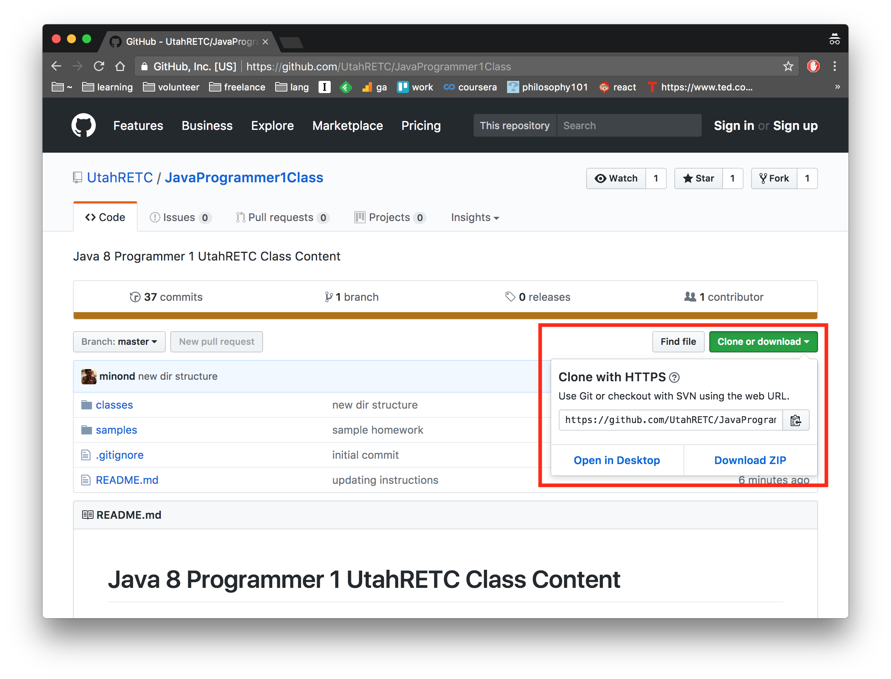

<!--
$theme: default
page_number: true
footer: Java Class - Class 6
-->

# Class 6

- **Arrays**
- **Strings**
- **Object references and primitives**
- **Value equality and identity equality**
- **Wrapper classes**
- **Varargs**

-----------------------------------------------------------------------------

# Class content can be downloaded by going to tiny.cc/urect-java

Download the files by clicking on "Clone or download" then click "Download ZIP".

-----------------------------------------------------------------------------



-----------------------------------------------------------------------------

# Arrays // copied over from week 1

Arrays are lists. In order to use an Array, you must declare the type as an Array and you must declare the type of the values the array will hold.

```java
public class ArraySample {
  public static void main(String[] args) {
    String[] myFriends;

    myFriends = new String[3];

    myFriends[0] = "Ryan";
    myFriends[1] = "Andi";

    System.out.println(myFriends[0] + " is my friend.");
    System.out.println(myFriends[1] + " is my friend.");
  }
}
```

-----------------------------------------------------------------------------


