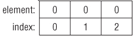
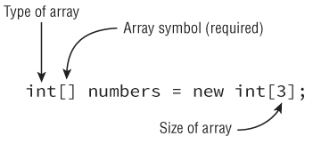
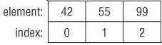

<!--
$theme: default
page_number: true
footer: Java Class - Class 5
-->
# Class 08 - Ammon Gruwell

- Arrays
- Strings
- Reference vs. Primitive
- Equality
- Wrapper Classes
- Varargs
-----------------------------------------------------------------------------
# Arrays

- An Array is an ordered list of items
  - {15, 31, 7}
  - {'a', 'g', 'x'}
- The items in the list are numbered starting at 0

- Arrays initialize to 0
- Arrays may contain duplicates
-----------------------------------------------------------------------------
# Creating An Array

- int[] numbers = new int[3];
  - Creates new array with three elements named my_array
  - What type is the variable "numbers"?
  - What type goes into this array?

-----------------------------------------------------------------------------
# Creating An Initialized Array

- int[] myNumbers = new int[] {42, 55, 99};
- int[] numbers2 = {42, 55, 99};
  - When initializing, we can leave off the "new int[]" part

-----------------------------------------------------------------------------
# Creating An Array: Syntax

- Which of these is valid Java syntax?
  - int[] myArray1;
  - int [] myArray2;
  - int myArray3[];
  - int myArray4 [];

-----------------------------------------------------------------------------
# Creating An Array of Objects

- String[] bugs = {"cricket", "beetle", "ladybug"};
- Array only contains references to the objects, not the objects themselves

- How does this array initialize?
  - String[] foods = new String[];
-----------------------------------------------------------------------------
# Using Arrays

- String[] animals = {"tiger", "kangaroo", "shark"};
- System.out.println(animals[0]); // tiger
- System.out.println(animals[2]); // shark
- System.out.println(animals.length); // 3
-----------------------------------------------------------------------------
# Array Review
- How do you get the length of an array?

-----------------------------------------------------------------------------
# Array Review
- How do you get the length of an array?
  - int len = myArray.length;

-----------------------------------------------------------------------------
# Array Review
- How do you initialize an array?

-----------------------------------------------------------------------------
# Array Review
- How do you initialize an array?
  - char[] myChars = {'w', 'g', 'b'};

-----------------------------------------------------------------------------
# Multidimensional Arrays

-----------------------------------------------------------------------------
# Strings

-----------------------------------------------------------------------------
# Object Reference vs. Primitive

-----------------------------------------------------------------------------
# Value Equality vs. Identity Equality

-----------------------------------------------------------------------------
# Wrapper Classes

-----------------------------------------------------------------------------
# Varargs

