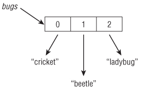
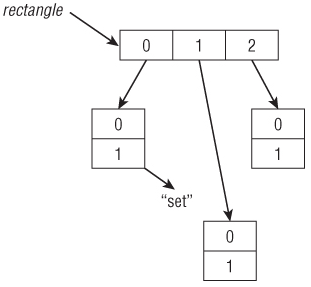

<!--
$theme: default
page_number: true
footer: Java Class - Class 5
-->
# Class 08 - Ammon Gruwell

- Arrays
- Strings
- References vs. Primitives
- Equality
- Wrapper Classes
- Varargs
-----------------------------------------------------------------------------
# Arrays

- An Array is an ordered list of items that are all of the same type
  - {15, 31, 7}
  - {'a', 'g', 'x'}
- The items in the list are numbered starting at 0


- Arrays initialize to 0
- Arrays may contain duplicates
-----------------------------------------------------------------------------
# Creating An Array
```
int[] numbers = new int[3];
```
- Creates new array with three elements named my_array
- Each element is initialized to 0
- What type is the variable "numbers"?
- What type goes into this array?


-----------------------------------------------------------------------------
# Creating An Initialized Array

```
int[] myNumbers = new int[] {42, 55, 99};
int[] numbers2 = {42, 55, 99};
```
- When initializing, we can leave off the "new int[]" part


-----------------------------------------------------------------------------
# Creating An Array: Syntax

- Which of these is valid Java syntax?
```
int[] myArray1;
int [] myArray2;
int myArray3[];
int myArray4 [];
```

-----------------------------------------------------------------------------
# Creating An Array of Objects

```
String[] bugs = {"cricket", "beetle", "ladybug"};
```
- Array only contains references to the objects, not the objects themselves


- In the following example, what does each item in the list initialize to?
```
String[] foods = new String[5];
```
-----------------------------------------------------------------------------
# Using Arrays
```
String[] animals = {"tiger", "kangaroo", "shark"};
System.out.println(animals[0]); // tiger
System.out.println(animals[2]); // shark
System.out.println(animals.length); // 3
```

-----------------------------------------------------------------------------
# Practice!
- Open up Multiples.java
-----------------------------------------------------------------------------
# Array Review
- How do you get the length of an array?

-----------------------------------------------------------------------------
# Array Review
- How do you get the length of an array?
  - int len = myArray.length;

-----------------------------------------------------------------------------
# Array Review
- How do you initialize an array?

-----------------------------------------------------------------------------
# Array Review
- How do you initialize an array?
```
char[] myChars = {'w', 'g', 'b'};
```

-----------------------------------------------------------------------------
# Multidimensional Arrays
- Arrays can have more than one dimension
- String[][] rectangle = new String[3][2];



-----------------------------------------------------------------------------
# Practice!
- Open up TwoDimArray.java
-----------------------------------------------------------------------------
# Strings
- A sequence of characters
- String myName = "Ammon";
  - Is this a primitive type?
  - If not, why no "new" keyword?

-----------------------------------------------------------------------------
# String Concatenation
```
- System.out.print("abc" + "de"); //abcde
- System.out.print(99 + " red balloons"); //99 red balloons
- System.out.print(9 + 9 + " red balloons"); //18 red balloons
```

-----------------------------------------------------------------------------
# String Concatenation Rules
- Rules to follow when concatenating:
  - When "adding" two numbers use numeric addition
  - Use string concatenation otherwise
  - Go left to right
```
int three = 3;
String four = "4";
System.out.println(1 + 2 + three + four);
```

-----------------------------------------------------------------------------
# String Immutability
- Mutable = changeable
- An immutable object is one that can't be changed once it is created
- Strings are immutable

-----------------------------------------------------------------------------
# String Immutability
- What does the following code print out?
```
String s1 = '1';
String s2 = s1.concat("2");
s2.concat("3");
System.out.println(s2);
```

-----------------------------------------------------------------------------
# String Comparison

```
String a = "12345";
String b = "12345";

//How will the following variables be set?
boolean ref_equality = (a == b) ? true : false;
boolean val_equality = (a.equals(b)) ? true : false;
```

-----------------------------------------------------------------------------
# The String Pool
- In order to save memory, Java reuses string literals
```
String a = "Error";
String b = "Error";
```
- In this code the variables a and b will both point to a single copy of "Error" in the Java String Pool


-----------------------------------------------------------------------------
# String Methods
- length() - returns the length of a string
```
String axiom = "Java Rocks!";
System.out.print(axiom.length()); //11
```
- charAt(int index) - returns the character at the specified index
```
System.out.print(axiom.charAt(5)); //R
System.out.print(axiom.charAt(15)); //Error!
```
-----------------------------------------------------------------------------
# String Methods
- indexOf(char c) - returns the index of a given character or string
  - indexOf(String s) 
```
String truth = "I love Java!";
System.out.print(truth.indexOf('v')); //4
System.out.print(truth.indexOf("Java")); //7
System.out.print(truth.indexOf("C++"); //-1
```
- substring(int start, int end) - returns part of a string
  - substring(int start)
```
System.out.print(truth.substring(7, 11) + " loves me"); 
//Java loves me
```
-----------------------------------------------------------------------------
# String Methods
- toLowerCase() - converts all letters in the string to lower case
  - toUpperCase()
```
String lie = "Java is Hard";
System.out.print(lie.toLowerCase()); //java is hard
System.out.print(lie.toUpperCase()); //JAVA IS HARD
```
- equals(String s) - checks value equality
  - equalsIgnoreCase(String s)
```
System.out.print(lie.equals("java is hard")); //false
System.out.print(lie.equalsIgnoreCase("java is hard")); //true
``` 
-----------------------------------------------------------------------------
# String Methods
- startsWith(String prefix) - indicates if the string starts with the given prefix
- endsWith(String suffix) - indicates if the string ends with the given suffix
- contains(String s) - indicates if the string contains the given substring
- replace(char c, char d) - replaces one char in the string with another
  - replace(String s, String t)
- trim() - trims off all whitespace before and after the string
-----------------------------------------------------------------------------
# Object Reference vs. Primitive

-----------------------------------------------------------------------------
# Value Equality vs. Identity Equality

-----------------------------------------------------------------------------
# Wrapper Classes

-----------------------------------------------------------------------------
# Varargs

