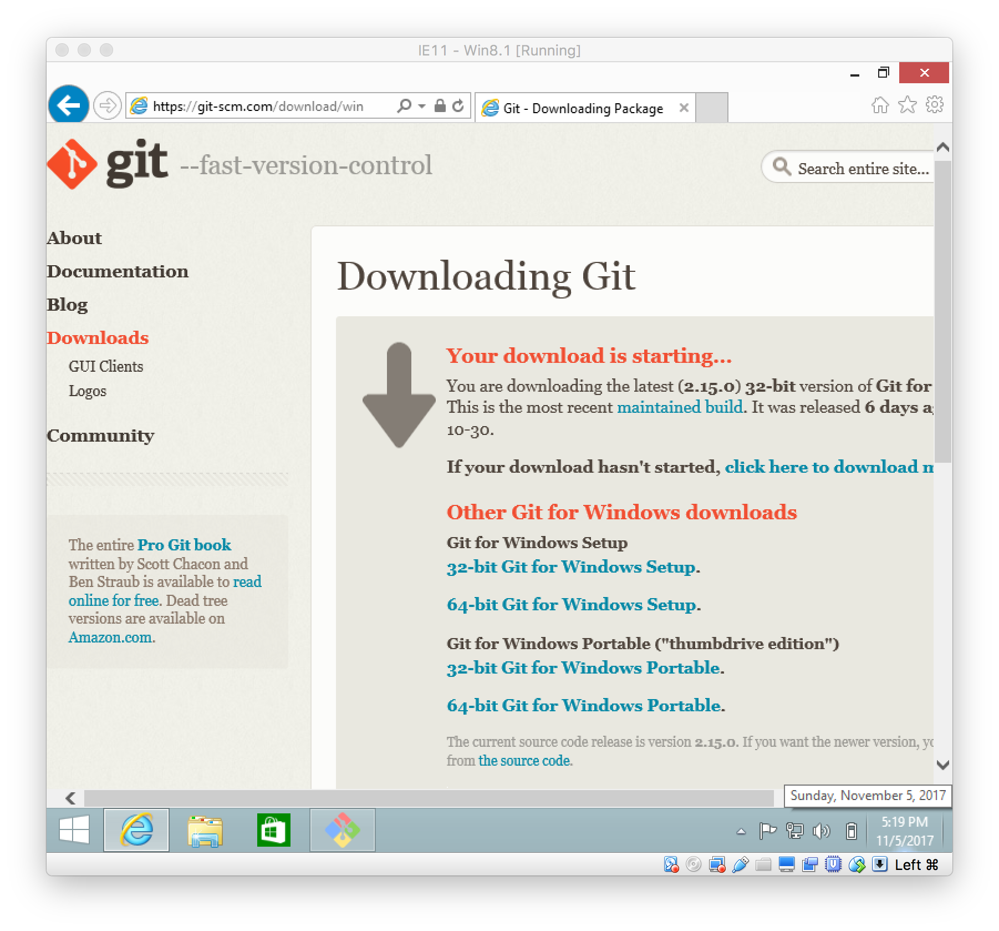
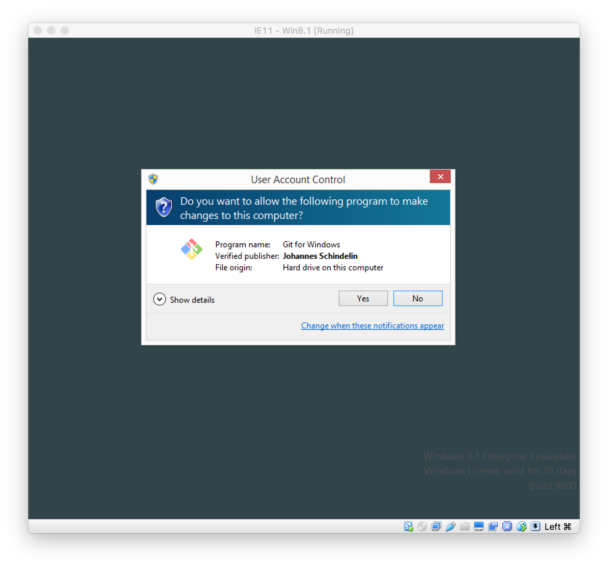
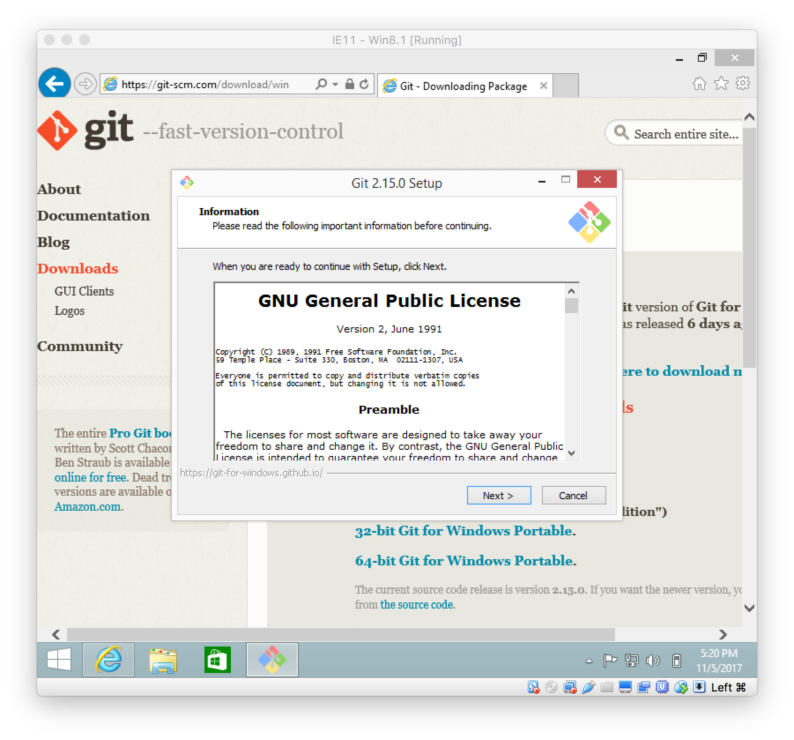
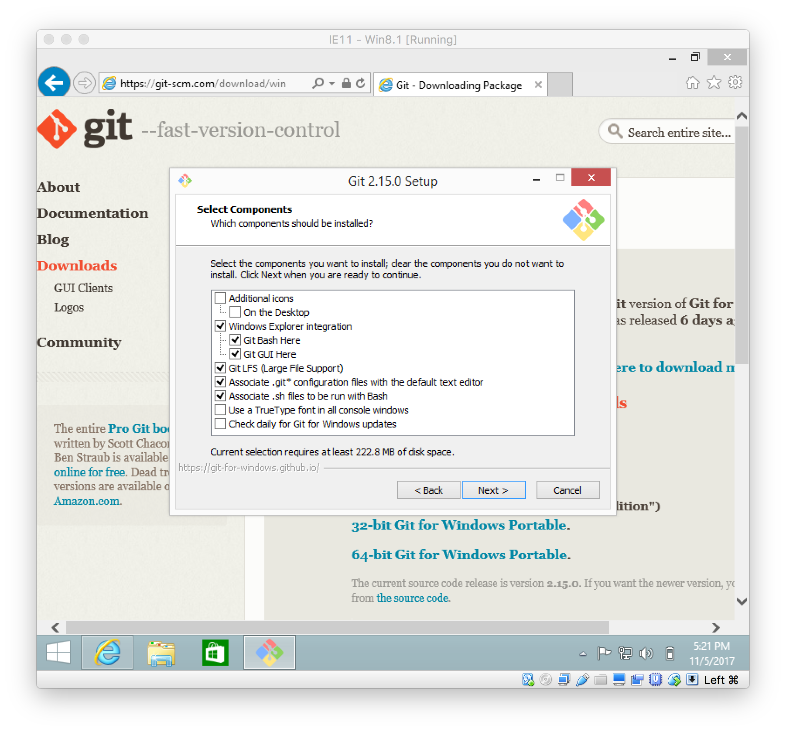
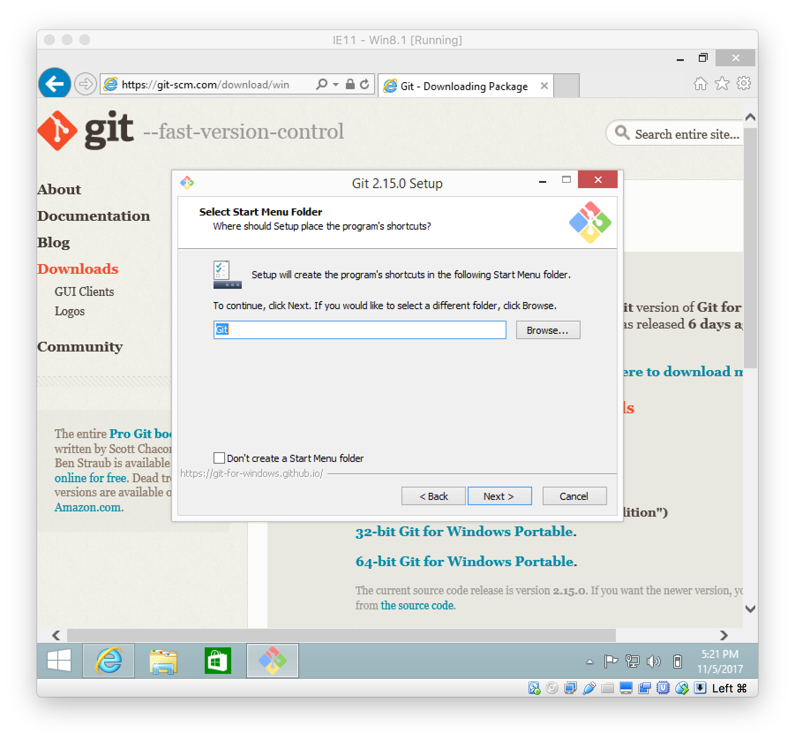
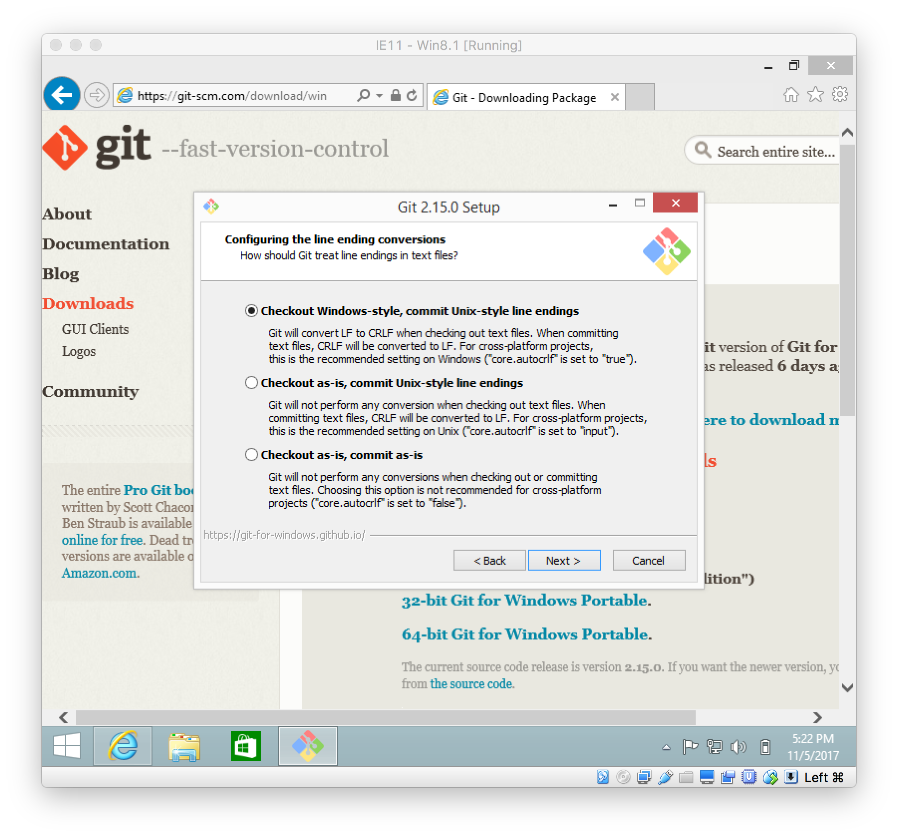
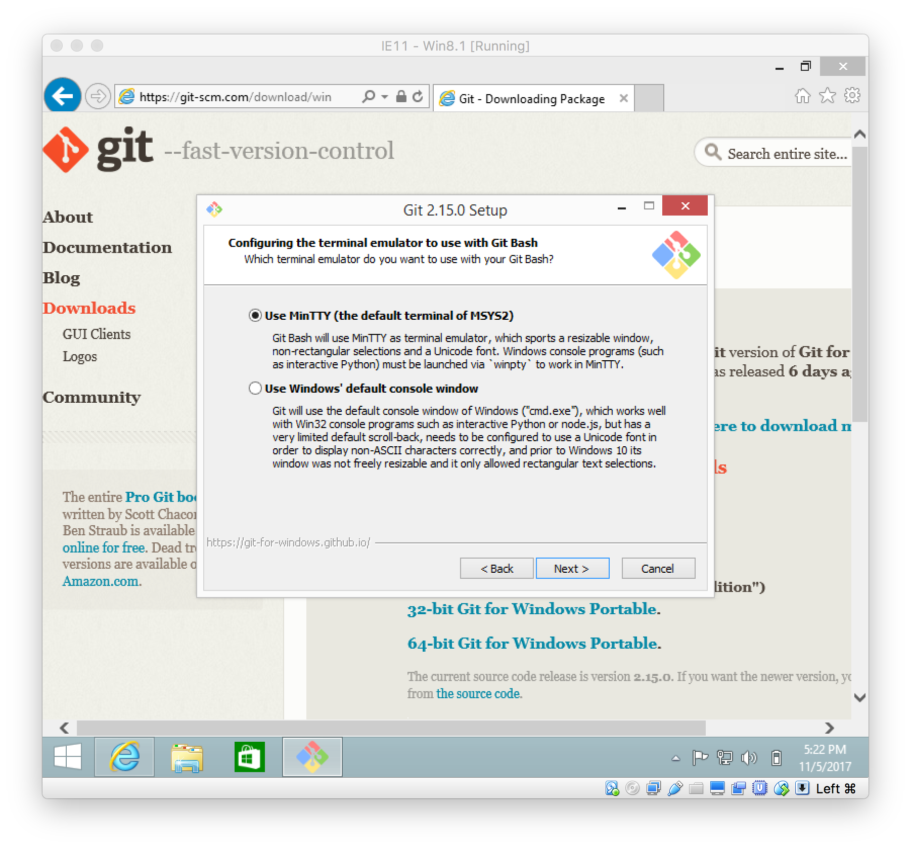
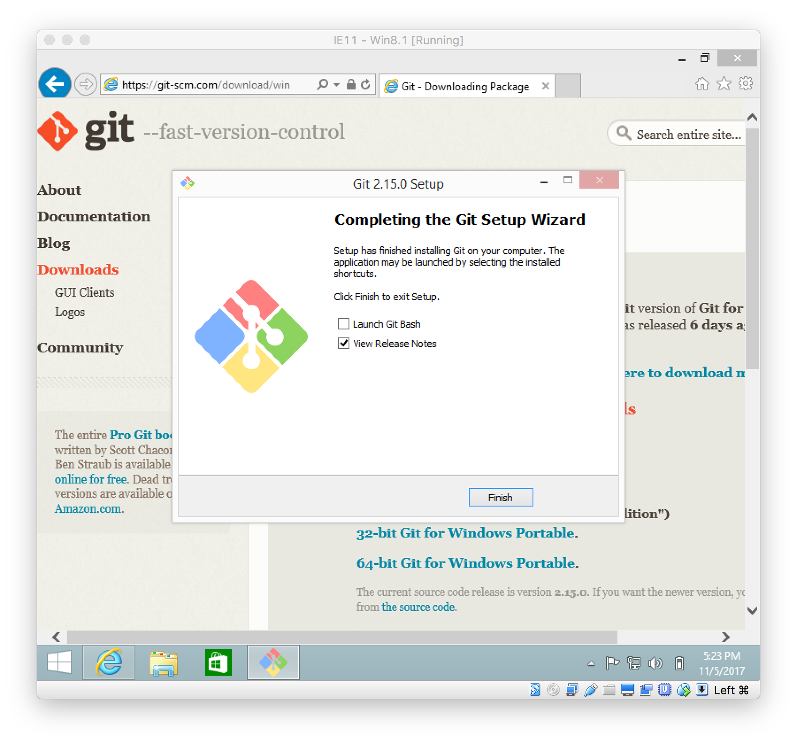
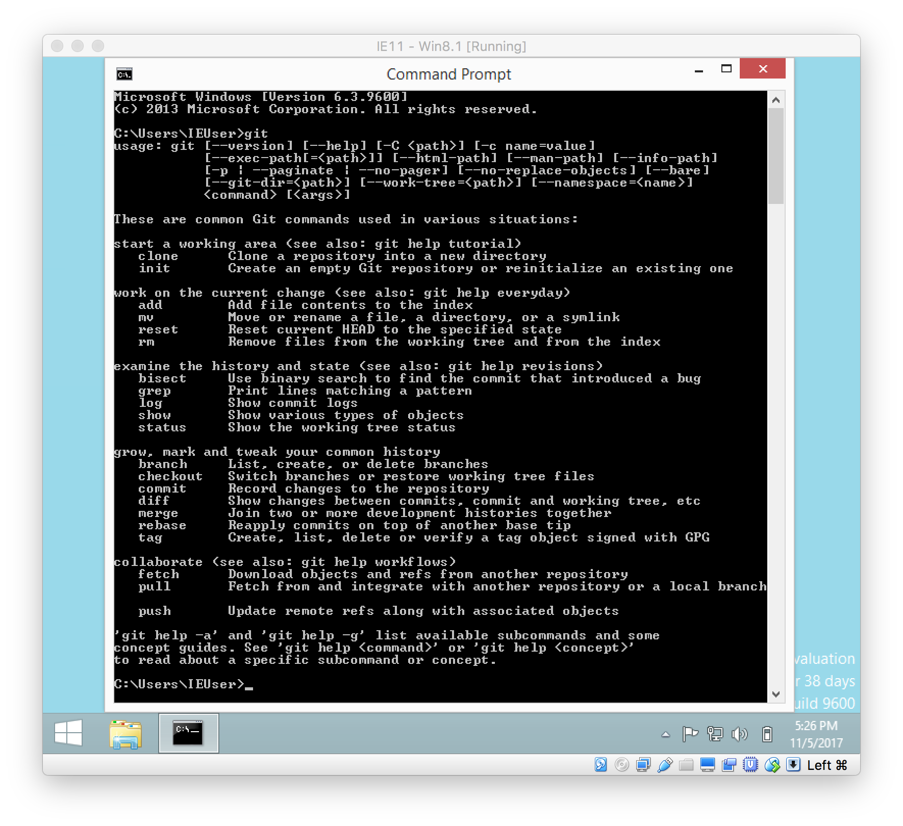

<!--
$theme: default
page_number: true
footer: Java Class - Module 6
-->

# Module 6

- **Git introduction.**
- **GitHub account creating**
- **Using Git and GitHub for class projects**
- **Project #1**

-----------------------------------------------------------------------------

# Project?

Instead of homework assignments this week, let's do a project! Let's start putting what you've been learning to use by building a database.

We'll use conditionals (`if` statements), loops (`for` statements), different data types (`String`, `int`, etc.), multiple classes and methods -- so everything we've gone over so far.

-----------------------------------------------------------------------------

# Git?

Git is a program that allows you to track updates in your code and easity share it as well. Git is heavily used in jobs and large projects, so we will use it to use to submit this and all future class projects.

-----------------------------------------------------------------------------

# Git

- A better way to "undo" changes,
- A better way to collaborate than mailing files back and forth, and
- A better way to share your code with your teammates and the world.

-----------------------------------------------------------------------------

### Git and GitHub can do a lot, but this is where we'll start:

- How to save your work in your own computer.
- How to save your work in your GitHub account.

-----------------------------------------------------------------------------

# What is GitHub?

- Free Git hosting after you create your account.
- Search, browse, download, and use Open Source software.

-----------------------------------------------------------------------------

# Git + GitHub = Dropbox for your code

-----------------------------------------------------------------------------

# New Terminology!

-----------------------------------------------------------------------------

==**Open Source**==: Any software whose source code (like the Java code you write) is freely available.

-----------------------------------------------------------------------------

# Installing Git

1. Go to https://git-scm.com/download/win

-----------------------------------------------------------------------------



-----------------------------------------------------------------------------



-----------------------------------------------------------------------------



-----------------------------------------------------------------------------


-----------------------------------------------------------------------------



-----------------------------------------------------------------------------



-----------------------------------------------------------------------------


-----------------------------------------------------------------------------


-----------------------------------------------------------------------------



-----------------------------------------------------------------------------



-----------------------------------------------------------------------------


-----------------------------------------------------------------------------



-----------------------------------------------------------------------------



-----------------------------------------------------------------------------

## Configure Git

```
> git config --global user.name "FirstName LastName"
> git config --global user.email "YourEmailAddress"
```

-----------------------------------------------------------------------------

# Creating a GitHub account

-----------------------------------------------------------------------------

# Git workflow

-----------------------------------------------------------------------------

# Creating a repository in GitHub

-----------------------------------------------------------------------------

# Cloning your repository

-----------------------------------------------------------------------------

# Making a change and pushing it to GitHub

-----------------------------------------------------------------------------

# Additional resources

-----------------------------------------------------------------------------

# Reference list
