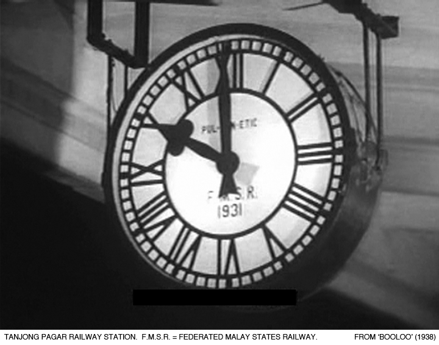
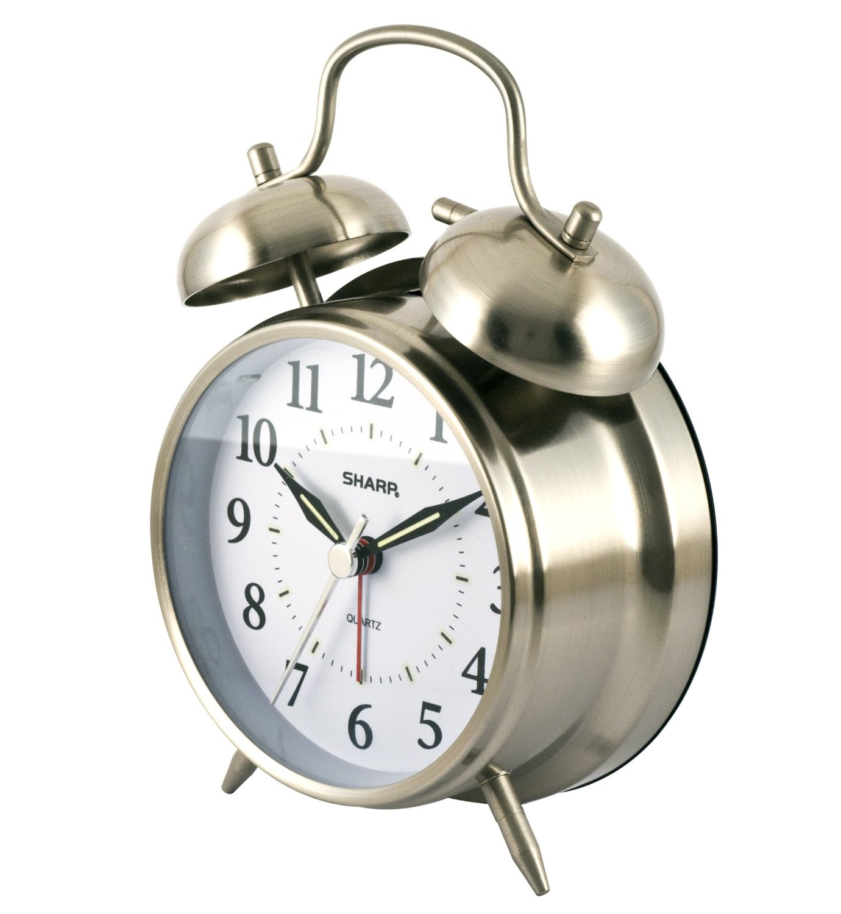
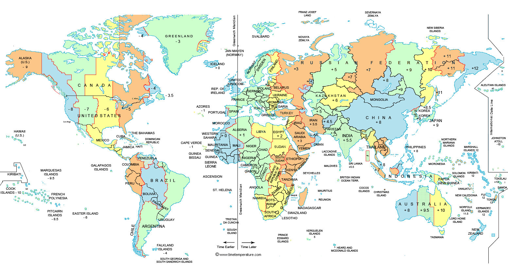

# Last Week

We learned about the <u>grammar and language rules</u> we must follow when programming in Java. 

Covered <u>entry points</u>, which are special methods or parts of code where our program will always start from. There is just one entry point per program and in Java it is the `main` method. 

Finally, we covered why good <u>style</u> matters in programming.

---
# What will we learn today?
* How to <u>create dates</u> — today, tomorrow, any day
* How to <u>create times</u> — now, an hour ago, 11pm
* How to <u>combine dates and times</u> into one object
* How to <u>add and subtract</u> dates and times
* <u>Periods</u>: how many days left in this month
* Printing dates and times nicely using <u>Formatters</u>
---
# Dates and Times

<center></center>

Almost all software uses dates and times. It is important to know how to use them.

<u>__Book__: Chapter 3, pages 138 to 152</u>

---

# What is a Date?

<center></center>

A date represents a <u>day</u>. It can be any day in the past, in the future, or today.

Dates in Java are represented by a [`java.time.LocalDate`](https://docs.oracle.com/javase/8/docs/api/java/time/LocalDate.html) object

To get today's date:

```java
LocalDate d = LocalDate.now();
```

If you output `d`, it will be `2018-01-27` 

---

# What is a Time?
<center></center>


A time represents a <u>time of day</u>, between midnight and 11:59:59pm

Times in Java are represented by a [`java.time.LocalTime`](https://docs.oracle.com/javase/8/docs/api/java/time/LocalTime.html) object

You can use `.now()` in the same way as with `LocalDate`.

```java
LocalTime t = LocalTime.now();
```

If you output `t`, it will be something like `14:36:23.723`

---

# Date and Time together

Very often, you want <u>both a date and a time</u> in one.

You can do that with [`java.time.LocalDateTime`](https://docs.oracle.com/javase/8/docs/api/java/time/LocalDateTime.html)

You can use `.now()` in the same way as before.

```java
LocalDateTime dt = LocalDateTime.now();
```
`dt` will be printed as `2018-01-26T14:36:23.723` 

--- 
# Practice

_10 minutes_

Write a program that prints out the current date **and** time.

Hint: `.now()`

---
# Common Operations

We already saw `.now()`, which works on all Date / Time classes we have learned:

```java
LocalDate d = LocalDate.now();
LocalTime t = LocalTime.now();
LocalDateTime dt = LocalDateTime.now();
```

We can also create instances with specific dates or times using `.of()`

`LocalDate yesterday = LocalDate.of(2010, 1, 1);`

--- 
# Common Operations

`.of()` accepts integers for year, month, day, hours, seconds:

```java
LocalDate yesterday = LocalDate.of(2010, 1, 1);
LocalTime noon = LocalTime.of(23, 0);
LocalDateTime l = LocalDateTime.of(2017, 1, 26, 12, 0);
```

You can also <u>combine a date and time object</u> to create a `LocalDateTime`: 

```java
LocalDateTime l2 = LocalDateTime.of(yesterday, noon);
```
<big>**?**</big> How do we create an object that represents midnight?
<big>**?**</big> How do we create an object that represents tomorrow, 3pm?

---
# Practice

_10 minutes_

Add to your program to also print out these things:
* Yesterday's date
* Noon (time)

Hint: `.of()`

---

# Adding and Subtracting

Methods to <u>add and subtract dates and times</u> are named `minus` and `plus` followed by the unit (Seconds, Days, Weeks), like this:

```java
LocalDate d = LocalDate.now();
LocalDate nextYear = d.plusYears(1);
LocalDate fourMonthsAgo = d.minusMonths(4);
LocalDate twoWeeksFromNow = d.plusWeeks(2);
LocalDate yesterday = d.minusDays(1);
```

You can use these on `LocalDate`, `LocalTime` and `LocalDateTime`. 

<big>**?**</big> How would you subtract three hours from a `LocalTime` object?
<big>**?**</big> What happens when you call `.addMinutes(1)` on a `LocalDate` object?

--- 
# Periods

A `Period` is a specific length of time. Defining periods makes your code more readable and reusable.

```java
Period aYear = Period.ofYears(1);
Period aQuarter = Period.ofMonths(3);
Period oneMonthAndFourDays = Period.of(0, 1, 4);

LocalDate d = LocalDate.now();
LocalDate nextYear = d.plus(aYear);
```

<big>**?**</big> How would you create a `Period` of 2 weeks, 3 hours, 20 seconds?
<big>**?**</big> Where and how would you use a `Period`?

---
# Other useful methods

If you want to determine if one date / time is before or after another: `.isbefore()` / `.isAfter()`

If you want to know the `Period` since or until another date / time: `.until()` / `since()`

```java
LocalDate now = LocalDate.now();
LocalDate christmas = LocalDate.of(2018, 12, 25);
Period untilChristmas = now.until(christmas);

LocalTime later = LocalTime.of(15, 0);
long toLater = t.until(endOfClass, ChronoUnit.MINUTES);
```

(`ChronoUnit` is in package `java.time.temporal`)

---
# Practice

_10 minutes_

Add to your program so that it prints the number of days left in this month.
Extra: also print the number of minutes until the end of class (3pm).

---
# Formatting Dates and Times

In the real world, we do not write dates as `2018-01-27` but as `1/27/2018` or `January 27, 2018` (in the United States).

To represent dates and times in 'human readable` format, we use a **Formatter**.


`LocalDate`
`LocalTime` ▶▶▶▶▶▶ **Formatter** ▶ _Human readable format_
`LocalDatetime`

---

# Formatting dates and times

We must first define a Formatter:

```java
DateTimeFormatter shortF = 
DateTimeFormatter.ofLocalizedDateTime(FormatStyle.SHORT);`
```

Then apply it to a date or time object:

```java
LocalDateTime now = LocalDateTime.now();
System.out.println(shortF.format(now));
// This will print: 1/24/18 2:42 PM
```

`DateTimeFormatter` lives in the `java.time.format` package.

---

# Formatting dates and times

You can also write your own formatting patterns. Example
```java
DateTimeFormatter f = 
	DateTimeFormatter.ofPattern("hh:mm");
LocalTime t = LocalTime.now();
System.out.println(t.format(f));
```
<big>**?**</big> What happens if we try to format a `LocalDate` instance using f?

--- 
# Practice

Add to your program so it prints the current time as `14 hours 30 minutes`.

Hint: look up _Patterns for Formatting_ in the `DateTimeFormatter` Java documentation. You can use single quotes `'` to include text in your format string.

---
# Summary
```
LocalDate d = LocalDate.now()
LocalTime t = LocalTime.of(13, 2, 10);
LocalDateTime dt = LocalDateTime.now();
LocalDateTime hourLater = dt.plusHours(1);
Period p = Period.of(1, 0, 7);
DateTimeFormatter f = 
   DateTimeFormatter.ofLocalizedDateTime(
   FormatStyle.SHORT);
```
## Do this:
* Watch [this video](https://app.pluralsight.com/player?course=java-8-whats-new&author=jose-paumard&name=java-8-whats-new-m3&clip=0&mode=live). Feel free to skip parts that make no sense.
* There are more video links on Canvas. Watch those as well.
* Review these slides and book pages 138-151
* Do homework on Canvas (module 10), submit before next class.

---
# Extra: Older ways

There are a lot of examples on the internet that use older ways of using dates and times. **<u>Do not use these</u>**.

```java
//DO NOT USE!
Date d = new Date();
Calendar c = Calendar.getInstance();
```

The <u>book</u> has more examples of old ways to create dates and times.

---
# Extra: Method Chaining

A pattern that is used a lot in Java is **method chaining**.

Method chaining is calling several methods in the same statement: `thing.doThis().thenThat().thenSomethingElse()`

We can use this with the add / subtract methods as follows:

```java
LocalDateTime l = LocalDateTime.now();
LocalDateTime someTime = l.plusYears(1).minusDays(1);
```
<big>**?**</big> What date / time will `someTime` be now?

--- 
# Extra: What about time zones?

We learned about using **Local** times and dates. This is all you need for the exam. It is possible to work with time zones in Java, but we will not cover this in class. [More info](https://docs.oracle.com/javase/tutorial/datetime/iso/timezones.html).



