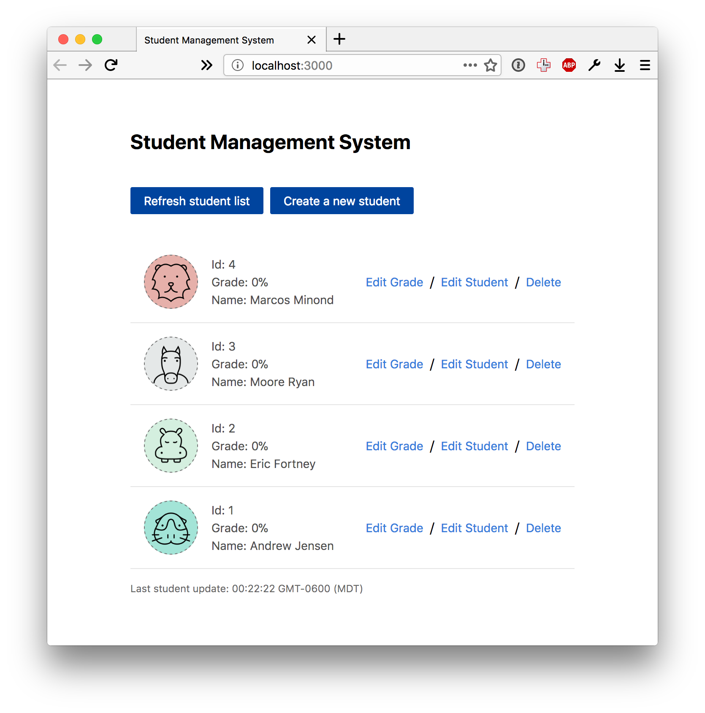

# Module 15 Homework

<style>
@media print {
  pre {
    border: 1px solid gray;
    page-break-inside: avoid;
  }
}

.break {
  page-break-after: always;
}
</style>

## Getting started

The code for this week's homework assignment is located in the class' main Git
repository in GitHub, https://github.com/UtahRETC/JavaProgrammer1Class. So to
get the code, you can either clone the code by running `git clone
https://github.com/UtahRETC/JavaProgrammer1Class.git` or downloading it by
going to https://github.com/UtahRETC/JavaProgrammer1Class/archive/master.zip
and extracting the content.

After getting the code, move the contens of `projects/server` into your own
repository. Once that's done you can build and run with server with the
following commands (make sure you run these inside of the `server` folter):

```bash
gradle build
gradle run
```

After running these commands successfully, go to http://localhost:3000/ in your
web browser and you should see something like this:

<center>
  
</center>


## Homework assignment

#### Add students more students to the School

1. You can find the hardcoded students in the `generateSchool` method in the
   `Main.java` file.


#### Add the update grade endpoint
1. First step will be to add a private `grade` property to the `Student` class
   along with getters and setters and updates to the contructor.
2. In the request handler, lookup the student that needs to be updated.
3. Set the grade method on the student using the setter method.
4. Convert the student object that was just updated into JSON and return it.


#### Add the delete student endpoint

1. First step will be to add a `removeStudentById` method in the `School`
   class.
2. Add a new request handler in the `main` method.
3. Follow the example of the `post("/api/students", (request, response)`
   method.
4. Remove the student from the school using the `removeStudentById` method
   created in step 1.
5. Convert the student object that was just removed from the school into JSON
   and return it.
