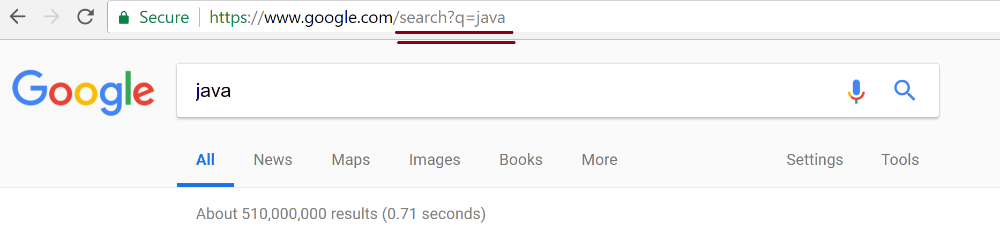
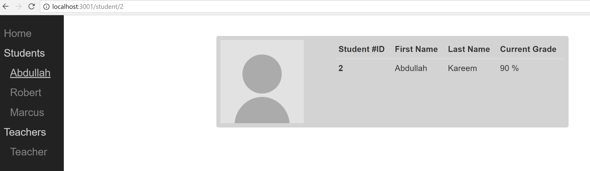
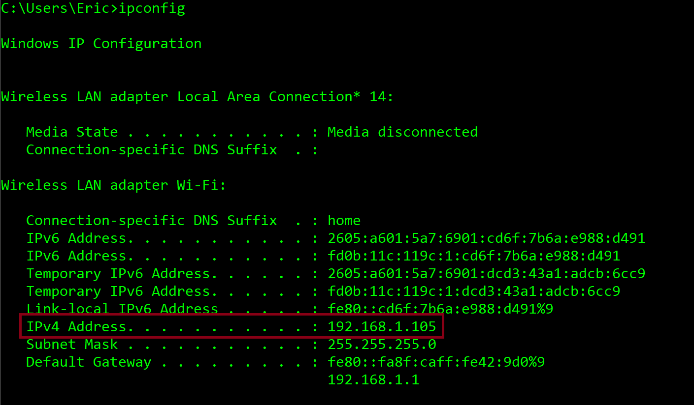

<!--
$theme: default
page_number: true
footer: Java Class - Web Server Project
-->

# Project 3: Web Server

- **Web Development Overview**
- **How to Communicate on the Web**
- **JSON**
- **This Week's Project: Web Server**

--------------------------------------------------------------------------


# Web Development Overview

--------------------------------------------------------------------------

## Server and Client Architecture

- This is how the web works!
- `Server`: one big, powerful computer out on the internet
- `Clients`: lots of little computers that connect to the server
- Example: I can do a Google search on my phone. My phone is the `client` and Google.com is the `server`.

--------------------------------------------------------------------------

## Why do we need "servers" and "clients"?

- We want to store our information in central places so everybody can get to it
  - A server can be in charge of giving the information to everybody
- Servers are public computers on the internet, and we don't want all of our personal computers to be public

--------------------------------------------------------------------------

## Other names

- The code that directly interacts with the `client` is often called the `front end` because it is in front of you.
- The code that directly interacts with the `server` is often called the `back end` because it is hidden behind the front end.

--------------------------------------------------------------------------

## What happens when I do a Google search on my phone?

- Step 1: My phone sends a `request` to the server at Google.com: "Please give me search results about Java."
- Step 2: Google.com finds search results and sends them back in a `response` so my phone can show them to me

--------------------------------------------------------------------------

## Requests and Responses

- How a client communicates with a server
- The client makes a `request` to get information
- The server returns a `response` back with that information

--------------------------------------------------------------------------

## Other Examples of Requests and Responses

- I navigate to Facebook on my computer and the Facebook.com server responds with my news feed
- I open the Spotify app on my Android phone and the Spotify.com server gives me a list of songs and playlists to browse

--------------------------------------------------------------------------


# How to Communicate on the Web

--------------------------------------------------------------------------

## Problem: everybody's computers are different

- Different locations around the world
- Different spoken languages (English, French, Arabic, etc.)
- Different programming languages (Java, C++, Rust, etc.)

We need a common way for every computer to speak to each other on the web.

We need a **protocol**.

--------------------------------------------------------------------------

## What's a Protocol?

- "A set of rules governing the exchange or transmission of data between devices"
- Analogy: when we send a letter, we need to follow the rules
  - sender's info in the top left corner
  - recipient's info in the middle
  - stamp in the top right corner

--------------------------------------------------------------------------

## HTTP

- Hypertext Transfer Protocol
- Rules for how to make `requests` and `responses` that others can understand

--------------------------------------------------------------------------

## An example HTTP request

When you type this into your browser:

<center></center>


It is making this request:

```text
GET /search?q=java HTTP/1.1
Host: www.google.com
accept: text/html,application/xhtml+xml,application/xml;q=0.9,image/webp,image/apng,*/*;q=0.8
accept-encoding: gzip, deflate, br
accept-language: en-US,en;q=0.9
cache-control: no-cache
user-agent: Mozilla/5.0 (Macintosh; Intel Mac OS X 10_11_6) AppleWebKit/537.36 (KHTML, like Gecko) Chrome/65.0.3325.162 Safari/537.36
```

--------------------------------------------------------------------------

## An example HTTP response

Google.com responds with this:

```text
HTTP/1.1 200 OK
Content-Type: text/html; charset=UTF-8
Date: Sat, 24 Mar 2018 04:12:21 GMT
Server: gws
Set-Cookie: 1P_JAR=2018-03-24-04; expires=Mon, 23-Apr-2018 04:12:21 GMT; path=/; domain=.google.com
Set-Cookie: NID=126=aI2SfiR_mUNuGxszTLvT5AyhUSeFgveN5dCxKC0Kc1oVGW0Ux9IPyP58bh8aOo-oCahn8-5GBx7qij0MzHuAr7jlnag7idD8nIbIexFC1Okg03K9VAHBbQW27PiJ0GPr; expires=Sun, 23-Sep-2018 04:12:21 GMT; path=/; domain=.google.com; HttpOnly

<!doctype html>
<html>
  <head>
    <title>java - Google Search</title>
  </head>
  <body>
    <!-- ... -->
  </body>
</html>
```

--------------------------------------------------------------------------

## Parts of the protocol:

**Our request:**

- The `headers`
  - The method: `GET`
  - The path: `/search?q=java`
- The optional `body`
  - This request does not have one.

**Google.com's response:**

- The `headers`
  - HTTP version: `1.1`
  - Status code: `200`
- The optional `body`
  - HTML, plain text, etc.
  - This response includes the HTML of the search results page.

--------------------------------------------------------------------------

## You've already seen some of this before!

- Path: this goes in your browser's URL bar
- Status code: have you ever seen a "404" error?

--------------------------------------------------------------------------

## Common HTTP Status Codes

- `200`: OK
- `401`: Not Authorized (you need to login)
- `403`: Forbidden (you can't see that data)
- `404`: Not Found (that data doesn't exist)
- `500`: Internal Server Error (there's a bug in the server code!)

--------------------------------------------------------------------------

## HTTP Methods

These methods let the client give different types of requests to the server.

Here are the most common methods:

- `GET`: Please give me some information
- `POST`: Please add this new information into the database
- `PUT`: Please update part of your information
- `DELETE`: Please delete some of your information

--------------------------------------------------------------------------

## Why do we need all of this again?

- We need a protocol to communicate over the web
- We want our computer programs to interact with each other properly

--------------------------------------------------------------------------

## We can create servers that others can use through APIs

API stands for Application Programming Interface, meaning the tools and functions for application software development.

The Java Standard Library has APIs like `System.out.println()`

Web APIs are kind of like *functions on the internet* that we can *use in apps*.

--------------------------------------------------------------------------

## An example web API

**GET /people**: Returns a list of all people in the system.

Example response body:

```json
{
  "people": [
    {
      "id": 1,
      "firstName": "Andrew",
      "lastName": "Jensen"
    },
    {
      "id": 2,
      "firstName": "Eric",
      "lastName": "Fortney"
    }
  ]
}
```
---------------------------------------------------------------------------
## An example web API (continued)
**GET /people/{ID}**: Returns a single person in the system.

Example response body:

```json
{
  "id": 1,
  "firstName": "Andrew",
  "lastName": "Jensen"
}
```

--------------------------------------------------------------------------

## An example web API (continued)

**POST /people**: Defines a new person in the system.

Example request body:

```json
{
  "firstName": "Andrew",
  "lastName": "Jensen"
}
```

Example response body:

```json
{
  "id": 1,
  "firstName": "Andrew",
  "lastName": "Jensen"
}
```

--------------------------------------------------------------------------

## What format was that text written in?

--------------------------------------------------------------------------


# JSON

--------------------------------------------------------------------------

## JSON: JavaScript Object Notation

- A grammar for sending data
- Not a programming language, just a grammar

--------------------------------------------------------------------------

## The JSON grammar

- Types of data:
  - String: `"Andrew"`
  - Number: `5`
  - Boolean: `true` or `false`
  - `null`
  - Arrays: `[ ]`
    - Separate data with commas: `["Hello world", 42, true]`
  - Objects: `{ }`
    - Made up of properties

--------------------------------------------------------------------------

## JSON Objects

- Made up of `properties`
- Every property has a `key` and a `value`
- A property key is always a String
- A property value can be any type of data

--------------------------------------------------------------------------

## A JSON Object Example

Notice the nesting, a JSON can contain objects within it
```json
{
  "id": 1,
  "firstName": "Andrew",
  "lastName": "Jensen",
  "education": { 		// <-- OBJECT
    "school": "Brigham Young University",
    "graduationYear": 2015,
    "major": "Computer Science"
  },
  "interests": [   // <-- LIST
    "Java programming",
    "Going to rock concerts",
    "Watching movies"
  ]
}
```

--------------------------------------------------------------------------

## We can turn our Java objects into JSON objects!

This Java:

```java
public class Person {
  public int id;
  public String firstName;
  public String lastName;
}

Person p1 = new Person(5, "Marcos", "Minond");
```

Becomes this JSON:

```json
{
  "id": 5,
  "firstName": "Marcos",
  "lastName": "Minond"
}
```

We can also turn JSON into Java objects.

--------------------------------------------------------------------------

## JSON is a good way to share data between a client and a server

- Why?

--------------------------------------------------------------------------

## JSON is a good way to share data between a client and a server

- Lets us speak the same "data language"
- Lets us `decouple` our data from our programming language
- JSON is very common these days

--------------------------------------------------------------------------

## An example JSON API on the web

Star Wars API!

https://swapi.co/


--------------------------------------------------------------------------

# This Week's Project: Web Server

--------------------------------------------------------------------------

## Project Overview

Software for a school grading system

For the teacher:

- see a list of students
- add new students
- change grades for each student

For the student:

- see their current grade

--------------------------------------------------------------------------

## Good News!

The client has already been written!

<center></center>

The server is started, but you need to finish it

--------------------------------------------------------------------------

## Side-note: Working in the industry

This is common!

- Working on a team of programmers
- Everyone writes parts of the code
- Decide on APIs together before you start coding

--------------------------------------------------------------------------

## Concepts we will use

- Client and Server architecture
- HTTP Requests and Responses
- JSON formatting for all messages

--------------------------------------------------------------------------

## Extra tools we will use

- The `spark` server framework
- The `Gson` library for working with JSON
- `gradle` for building and running our code

Instructions for downloading `gradle` can be found on its [installation page](https://gradle.org/install/).

--------------------------------------------------------------------------

## Let's look at the code!

--------------------------------------------------------------------------

## Now, let's run the code!

After you have gradle, run these terminal commands in the project directory:

```text
$ gradle build
$ gradle run
```

Now, navigate to `http://localhost:3000` in your web browser.

--------------------------------------------------------------------------
## Why can't people visit my site?

`localhost` is a special keyword, not a specific website domain. It just tells the computer: "Grab my current IP address"

It is like telling someone:
- "The package is at my house" or
- "The package is at 300E 721N, Salt Lake City, UT 84500"

--------------------------------------------------------------------------

## Sharing your site

Enter ``ipconfig`` from the Windows Command Line. Copy the ``IPv4 Address`` with our given port number (more of those later). For me its: ``192.168.1.105:3000`` (Note this will change with each new internet connection you make. Real servers don't move around!)
<center></center>


--------------------------------------------------------------------------

## Homework instructions

See the homework document and the API specs

Submit a link to your code repo on Canvas
