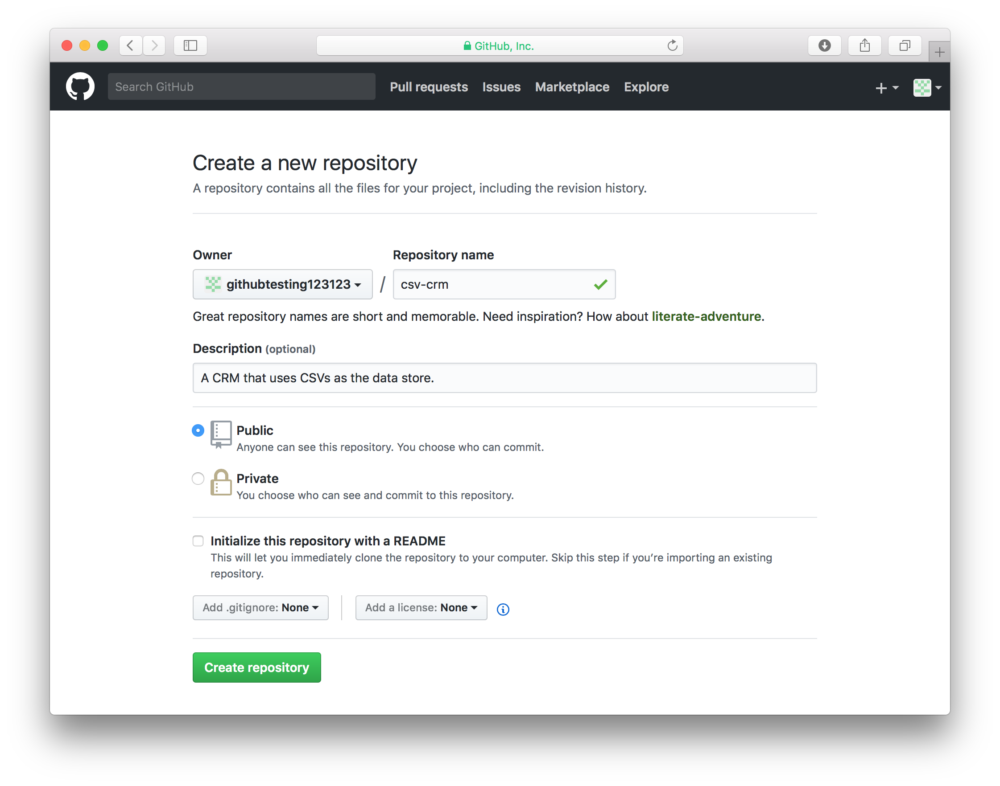

<!--
$theme: default
page_number: true
footer: Java Class - Project 1
-->

# Project 1

- **Git introduction.**
- **GitHub account creating**
- **Using Git and GitHub for class projects**
- **Project #1 introduction**

-----------------------------------------------------------------------------

# Project?

Instead of homework assignments this week, let's do a project! Let's start putting what you've been learning to use by building a database.

We'll use conditionals (`if` statements), loops (`for` statements), different data types (`String`, `int`, etc.), multiple classes and methods -- so everything we've gone over so far.

-----------------------------------------------------------------------------

# Git?

Git is a program that allows you to track updates in your code and easity share it as well. Git is heavily used in jobs and large projects, so we will use it to use to submit this and all future class projects.

-----------------------------------------------------------------------------

# Git

- A better way to "undo" changes,
- A better way to collaborate than mailing files back and forth, and
- A better way to share your code with your teammates and the world.

-----------------------------------------------------------------------------

# What is GitHub?

GitHub is a site where you can host your code for free after you create an account. It is a place where anyone can search, browse, download, and use Open Source software. It doesn't *run* your code, but it just *stores* it.

-----------------------------------------------------------------------------

# New Terminology

==**Open Source**==: Any software whose source code (like the Java code you write) is freely available.

-----------------------------------------------------------------------------

# Git + GitHub = Dropbox for your code

-----------------------------------------------------------------------------

# Git and GitHub can do a lot, but this is where we'll start:

- How to save your work in your own computer.
- How to save your work in your GitHub account.

-----------------------------------------------------------------------------

# What's next

1. Install Git.
2. Signup for GitHub.
3. Create a space in your GitHub account to store the first project.
4. Git commands you'll need to know.

-----------------------------------------------------------------------------

# Installing Git

Go to https://git-scm.com/download and select the operating system that you're using. If you're on Windows, make sure you know if you have 32 or 64 bit versions. The next slides are screenshots of installing Git in Windows.

-----------------------------------------------------------------------------


-----------------------------------------------------------------------------


-----------------------------------------------------------------------------


-----------------------------------------------------------------------------


-----------------------------------------------------------------------------


-----------------------------------------------------------------------------


-----------------------------------------------------------------------------


-----------------------------------------------------------------------------


-----------------------------------------------------------------------------


-----------------------------------------------------------------------------


-----------------------------------------------------------------------------


-----------------------------------------------------------------------------


-----------------------------------------------------------------------------

# Now open your terminal and run `git`.
# What do you see?

-----------------------------------------------------------------------------


-----------------------------------------------------------------------------

# Configure Git

Let's give Git your name and email so that it knows who you are.

```
> git config --global user.name "FirstName LastName"
> git config --global user.email "YourEmailAddress"
```

-----------------------------------------------------------------------------

# Next let's create a GitHub account

Now that you have Git installed in your computer, we're going to create a GitHub account so that you can store your code in both your computer and online. Go to https://github.com to start the process.

-----------------------------------------------------------------------------


-----------------------------------------------------------------------------


-----------------------------------------------------------------------------


-----------------------------------------------------------------------------


-----------------------------------------------------------------------------


-----------------------------------------------------------------------------



-----------------------------------------------------------------------------


-----------------------------------------------------------------------------

# New Terminology

==**Repository**==: repositories are where you store your Git projects. They track the code and have a history of all of the updates.

-----------------------------------------------------------------------------

# Git commands

- `git add`
- `git commit`
- `git push`
- `git status`
- `git clone`

-----------------------------------------------------------------------------

# `git add`

By default, Git does not care about every file in the repository. If you want Git to track changes you make to a file, you have to "add" it by running `git add <FILENAME>`.

Once you have added a file with `git add`, Git remember this action and so you won't have to run `git add` again on that file, with the exception being if you rename the file.

-----------------------------------------------------------------------------

# `git commit`

Think of a commit as a package containing changes you have made to your code. Let's say we just finished adding a feature to our project, we would create a commit which basically packages all of those changes and formats them in a way that I can then share when the rest of my team or the rest of the internet.

You can create commits when ever and as onften as you'd like. The only requirement is that there is at least one character change in a file that Git is tracking.

-----------------------------------------------------------------------------

# `git push`

Committing you updates doesn't mean they'll be shared with others that have access to the repository.

To share these changes with everyone else, you have to "push" your commits. The command `git push` takes the commits that only exist locally (on your computer) and pushes them to the remote Git server (GitHub.com).

-----------------------------------------------------------------------------

# `git status`

This simple command will give you information about the current state of your repository. With this command you can see which files are untracked by Git, which tracked files have modifications, and also which files you have recently started tracking with Git.

When you create a new commit, Git will put all changes and new files in the commit and so they will not show up when you run `git status`, but what you will see is that there is a local commit that needs to be pushed (with `git push`.)

-----------------------------------------------------------------------------

# Cloning your repository with `git clone`

-----------------------------------------------------------------------------

`git add`: Use this command to tell Git to start tracking the changes you make to a file.

`git commit`: Use this command once you are done with a set of updates to your code and you are ready to package them so that you can share them with others.

`git push`: Use this command to make your commits available to the rest of your team.

`git status`: Use this command to get information about your repository. Tells you what files Git is not tracking and which ones you have modified.

`git clone`: Use this command to download a copy of a repository to your own computer.

-----------------------------------------------------------------------------

# Making a change and pushing it to GitHub

-----------------------------------------------------------------------------

# The Project

- What we're doing.
- What we're providing.
- What you need to finish on your own.
- Testing your work.

-----------------------------------------------------------------------------

# Additional resources

-----------------------------------------------------------------------------

# Reference list
